# 제품 요구사항 문서 (PRD)

## 1. 제품 개요 (Overview)
- 제품 이름: Prompting Project Layer Editing 
- 캐치프라이즈 : “Product Placement , 웹툰으로의 손쉬운 이식”
- 제품 설명 : 웹앱 기반 PPL 합성 플랫폼
또한 제작뿐만이 아니라 해당 작업을 프로젝트 단위로 묶어서 관리하거나 템플릿으로 가공하여 사용자가 사용하기 쉬운 형태의 자동화 도구또한 제공한다.
- 주요 목표: 부분합성 모델 API를 활용하여 웹툰 PPL(간접 광고)를 (광고 리소스 + 웹툰 컷 리소스)의 형태로 받아와 여러 단위로 분할하여 다루고 부분합성
- 기대 효과:
    - 시간적 비용 : 그림 합성/작업에서 프롬프트 기반 생성으로 변경
    - 대량 생산성 요구 : 노이즈 시드 기반으로 생성형 AI 특유의 대량 생산을 구현할 수 있음
    - 작업량 증가 : 다양한 광고주의 초안 요구에 큰 작업 부담없이 대응할 수 있음
---

## 2. 문제 정의 (Problem Definition)
- 제품 배경:
    - 간접광고(PPL)은 드라마/영화, 유튜브 영상같은 엔터테인먼트 창작물에서 소비자에게 자연스럽게 이미지나 상품을 노출하여 상업적인 마케팅 효과를 내는 방식이다. 이는 원래 실존하는 영상 창작물에서 주로 사용되나 웹툰이나 애니메이션같은 가상 창작물에서도 종종 시도되고 있다. 현대의 생성형 AI 모델, 특히 부분 합성 특화 모델 ‘나노바나나’의 등장은 현실의 상품이나 로고 등을 그림작가가 직접 그려내거나 추가해야 하는 과정을 어느 정도 자동화하고 광고 설계 및 작업의 효율량을 크게 향상시킬 수 있게 되었다.
- 현재 문제 상황:
    1. **작업 방식**
        - 수작업에 의존: 웹툰 작가 직접 그리기 또는 Photoshop 같은 이미지 편집 도구 활용
    2. **시간적 비용**
        - 컷당 평균 4-5시간 소요
    3. **작업량 증가 케이스**
        - 동일한 컷에 대해 5-10개의 배치안 변형 생성 필요
        - 20개의 다양한 컷에 동일한 제품을 반복 배치 필요
        - 결과: 작업량 3-4배 이상 증가
    4. **기획 및 수정 요구**
        - 광고 기획이 웹툰 창작과 별개로 필요
        - 광고주의 요구사항에 따라 빈번한 수정 및 추가 작업 발생
    5. **현황의 핵심 문제**
        - 작업자의 부담 가중
        - 대량 초안 생산 요구 시 효율적 대응 곤란
        - 생성형 AI를 웹툰 PPL 워크플로우에 통합할 체계적 플랫폼 부재

**[인포그래픽 이미지 프롬프트]**
> 웹툰 PPL 작업의 현재 문제 상황을 시각화한 인포그래픽을 생성해주세요:
> - 좌측: 수작업 기반 작업 방식을 나타내는 아이콘 (Photoshop, 손 그리기)
> - 중앙상단: 시간 투자 표시 (⏱️ 컷당 4-5시간)
> - 중앙중단: 작업량 증가 비율 그래프 (기본 1배 → 3-4배 증가 시각화)
> - 우측상단: 동일한 컷에 5-10개 배치안, 20개 컷 반복 배치 아이콘
> - 우측중단: 광고 기획과 수정 요구 빈도를 나타내는 피드백 루프
> - 하단: 핵심 문제 3가지를 강조하는 네거티브 톤 아이콘 (작업자 부담↑, 비효율↑, 플랫폼 부재)
> - 컬러: 현재 상황의 심각성을 표현하기 위해 따뜻한 빨간색/주황색 톤 사용
> - 스타일: 현대적이고 명확한 비즈니스 인포그래픽 스타일

- 해결해야 할 핵심 Pain Points:
    - 웹툰 PPL 작업을 작업자(작가)가 직접 작업해서 구현하거나 Photoshop 기반의 수작업으로 이루어짐 → 시간적 비용
    - 동일한 컷에 대한 여러 결과물 또는 다양한 컷에 같은 제품을 반복적으로 등장시켜야 할 수 있음 → 기존 웹툰과는 다른 대량의 초안 요구
    - 광고인 만큼 웹툰 자체와 별개인 기획이 필요하며 광고주의 요구에 따라 결과를 유동적으로 변경/추가가 필요할 수 있음 → 작업량 증가
- 문제의 비즈니스적/사용자적 영향:

---

## 3. 핵심 고객층 (Target Users)
### 주요 사용자 그룹
    1. 광고주·브랜드 마케팅 팀
    2. 웹툰 제작사·웹툰 PPL 대행사
    3. 웹툰 작가(작가·편집 담당자)
---
### 광고주·브랜드 마케팅 팀
- 사용자 특성
    - **비즈니스 의뢰자, 결정권자에 해당함**
    - 상품을 어떤 방식으로 웹툰에 노출할 것인지”에 대한 기획안을 요구함
    - 실물 컷에 적용해 보는 결과를 평가하고 수정을 요구할 수 있음
- 사용자 니즈
    - 다양한 배치 레이아웃을 빠르게 비교 검토할 수 있음
- 사용자 시나리오
    - 화장품 브랜드 마케팅 담당자 A는 인기 웹툰에 신제품을 PPL로 삽입하고자 한다. 대행사로부터 받은 3가지 배치안(테이블 위, 캐릭터 손에 들림, 배경 선반)에 대해 각각 5개의 변형 시안을 요청한다. 플랫폼을 통해 생성된 총 15개의 결과물을 웹 뷰어에서 빠르게 비교하며, 가장 자연스럽고 브랜드 노출이 효과적인 2개의 시안을 선택하여 승인한다. 전체 검토 과정이 기존 2-3일에서 2-3시간으로 단축된다.
---
### 웹툰 제작사·웹툰 PPL 대행사
- 사용자 특성
    - **플랫폼의 직접 구매자이자 주요 관리자**
    - 사용자 입장인 광고주와 작업자 입장인인 웹툰 편집자 사이에서 조율해야함
    - 광고주에게서 특정 사항과 광고의 소재를 의뢰받음
    - 광고를 기획하고 편집자에게 PPL의 작성을 직접적으로 요구함
- 사용자 니즈
    - 대량 합성(Batch Processing)을 통한 높은 생산성을 확보.
    - 작업 지시를 내릴때 작업 패턴을 일관화하여 효율성을 높일 수 있다
    - 실제 포토샵, 그림 작업의 비중이 적으므로 PPL 합성에 직접 관여할 수 있음
- 사용자 시나리오
    - PPL 대행사 PM B는 한 달에 5개의 웹툰에 각각 3-4개의 광고를 삽입하는 프로젝트를 관리한다. 광고주로부터 받은 제품 이미지와 브랜드 가이드라인을 기반으로 템플릿을 생성하고, 작가가 업로드한 20개의 웹툰 컷에 일괄 적용한다. 배치 처리로 200개의 초안을 생성한 뒤, 품질이 우수한 결과물을 필터링하여 광고주에게 전달한다. 템플릿을 저장해두어 다음 화차 작업 시 동일한 설정을 재사용할 수 있다. 기존에 작가와 주고받던 수정 요청 커뮤니케이션이 크게 줄어든다.
---
### 웹툰 작가(작가·편집 담당자)
- 사용자 특성
    - **실제 작업 실행자, UX 만족도가 제품 성공에 직결**
    - 주 단위로 마감 일정이 매우 빠르고 작품 내 장면을 반복적으로 그려야 함
    - PPL 장면은 광고주와 협의된 정확한 배치·크기·이미지 사용이 요구됨
    - 세밀한 합성 작업에 많은 시간 소요
    - 입장이 전혀 다른 제작사와의 커뮤니케이션이 요구됨  
    - 웹툰 그림 + PPL 합성 = 이중 업무 부과
- 사용자 니즈
    - 템플릿 기반으로 컷 합성을 자동화할 수 있음
    - 수작업량을 크게 줄일 수 있음
    - 직접 그리는 부분을 웹앱 인터페이스로 넘겨 외주와 효율적인 의사소통이 가능
- 사용자 시나리오
    - 웹툰 작가 C는 주 단위 연재 마감이 빠듯한 상황에서 음료 브랜드 PPL 요청을 받는다. 제작사로부터 전달받은 템플릿을 확인하고, 자신의 웹툰 컷 8장을 업로드한다. 각 컷에서 제품이 들어갈 영역을 마스크 도구로 간단히 지정하고 생성 버튼을 클릭한다. AI가 생성한 여러 결과물 중 웹툰 화풍과 가장 잘 어울리는 것을 선택하고, 미세한 색감 조정만 추가로 수행한다. 기존에 Photoshop으로 4-5시간 걸리던 작업이 30분 내로 완료되어, 본 연재 작업에 집중할 수 있게 된다.

---

## 4. 핵심 개념 및 데이터 모델 (Core Concept & Data Model)

### 4.1 트리 기반 이미지 관계 구조도 (선순위)
- 핵심 개념 정의: 원본 이미지를 루트로 삼고, LLM 분석 결과를 트리 구조로 정리한다.
- 주요 엔티티(Entity) 및 속성
    - Source: 원본 이미지, 초기 추출 프롬프트
    - Root structure: Source의 1차 자식 관계
        - `scene`, `objects`, `environment_objects`, `text_elements`, `relationships`, `implicit_information`
    - Based field: Root structure 기반으로 자동 생성되는 객체/요소
        - Attributes: 요소의 세부 정보
        - Custom Attributes: 사용자가 추가하는 세부 속성
    - Custom field: 사용자가 추가하는 필드
        - 필요 시 하위 계층으로 중첩 가능
        - Root structure는 편집 불가, 최소 편집 단위는 Source의 2차 자식부터
- 데이터 흐름
    - Source -> Root structure -> Based field/Custom field -> (Custom) Attributes
- *데이터 관계 다이어그램 예시*

|  |  |
| --- | --- |
| 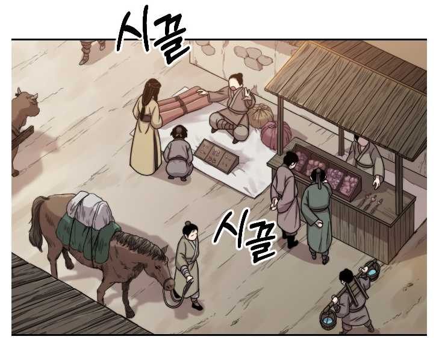 | 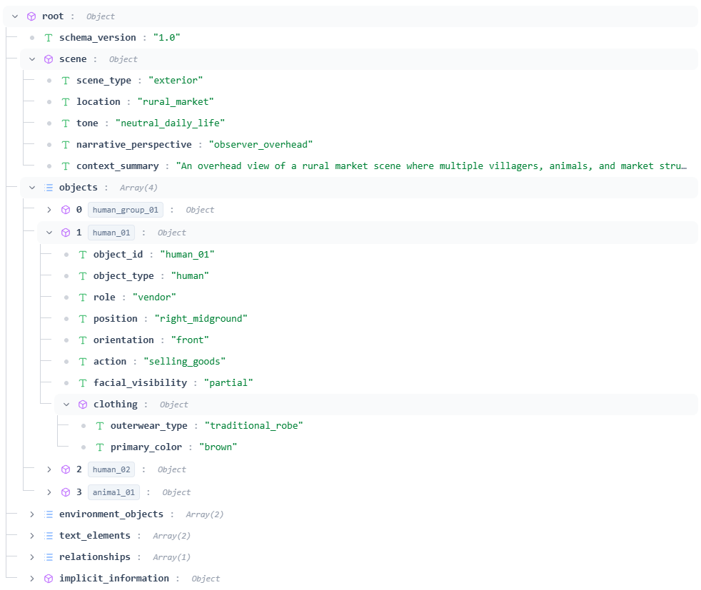 |

### 4.2 DAG 기반 이미지 편집 의사결정 모델 (후순위)
|  |  |
| --- | --- |
| 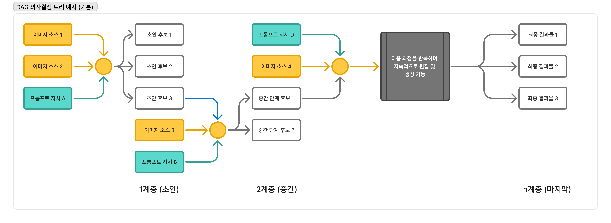 | 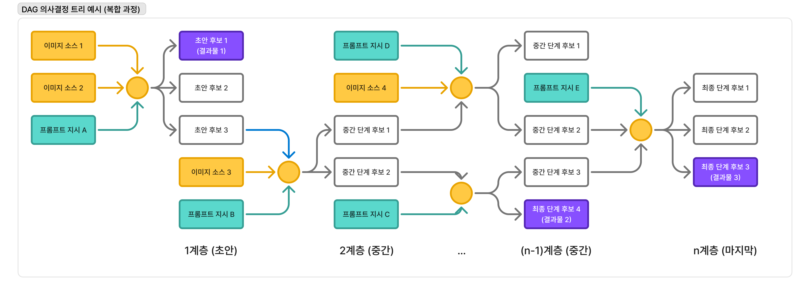 |

- 핵심 개념 정의: 특정 milestone 목표를 달성하기 위해, 후보 결과를 다중 분기/병렬로 탐색하는 편집 의사결정 그래프
- 작업 프로세스
    1. 기본 이미지와 추상적 목표(아직 구체화되지 않은 의도)로 시작한다.
    2. 사용자 프롬프트와 합성 소스를 반영한 자식 후보 노드를 생성한다.
    3. 사용자는 목표에 가까운 후보 노드를 선택해 2번 과정을 반복한다.
    4. 반복을 통해 의도에 근접한 결과 이미지로 수렴한다.
    5. 기본은 선형(편집-채택) 흐름이지만, 동일 계층에서 병렬 탐색이 가능하다.
    6. 최종적으로 채택된 복수의 결과물이 milestone 산출물이 된다.

---

## 5. 핵심 개념-기능 목록 (Functional Requirements)
- 기능 1: 트리 기반 이미지 관계 구조도 생성 및 정밀 편집 (High)
    - 목적: 특정 이미지의 요소를 구조화하여, 사용자가 직관적으로 부분편집 지점을 지정하고 프롬프트를 정밀하게 설계할 수 있도록 한다.
    - 핵심 동작
        - 이미지 분석 후 Root structure 아래에 `Based field`를 자동 생성한다.
        - 사용자는 `Based field`에 `Custom Attributes`를 추가하거나, `Custom field`를 신규 정의한다.
        - 맥락적으로 종속되는 요소는 하위 계층으로 배치 가능하다. (예: 코트 > 단추)
        - 트리의 특정 필드/속성명을 편집 프롬프트에 직접 참조하여 부분편집을 수행한다.
    - 입력/출력
        - 입력: 원본 이미지, 초기 추출 프롬프트(선택), 사용자 추가 필드/속성 정의
        - 출력: 이미지 관계 트리 JSON, 편집 지점 식별자 목록, 프롬프트 참조 경로
    - 사용 시나리오
        - 사용자는 코트 객체를 선택하고 `material` 속성을 추가한다.
        - 코트의 단추를 하위 필드로 분리하여 버튼 디테일만 부분편집한다.
    - 제약
        - Root structure 자체는 편집 불가하며, 최소 편집 단위는 Source의 2차 자식 관계부터 가능하다.

- 기능 2: 프로젝트 기반 텍스트 편집 워크플로우 (Medium)
    - 목적: 텍스트 프롬프트 기반의 반복 요청-응답 방식을 프로젝트 단위의 체계적인 워크플로우로 전환한다.
    - 핵심 동작
        - 프로젝트 내 원본 웹툰 컷, product, logo를 에셋으로 관리한다.
        - PPL 제휴사 메타데이터를 에셋과 연결해 관리한다.
        - 편집 실행 기록을 `history`로 저장하고, 목적 단위로 `milestone`을 묶어 관리한다.
        - milestone : github에서 유래된 단어로, 사용자가 특정 목적에 따라 분류되는 하나의 작업 단위
        - milestone 간의 관계를 시각화해 대안 경로 탐색과 롤백을 지원한다.
        - milestone 작업은 DAG 기반 의사결정 프로세스를 통해 후보 결과를 체계적으로 탐색할 수 있다. *(상세는 4.2)*
    - 입력/출력
        - 입력: 프로젝트 컷 이미지, 제품/로고 에셋, 편집 프롬프트, milestone 정의
        - 출력: 편집 결과물 버전, history 로그, milestone 관계도
    - 사용 시나리오
        - 사용자는 특정 컷에 대한 여러 편집 시도를 milestone으로 묶고 결과물을 비교한다.
        - 관계도에서 이전 분기점으로 이동해 다른 편집 방향을 시도한다.

- 기능 3: 편집 프롬프트 설계 가이드 에이전트 (Low)
    - 목적: 사용자의 의미적 서술을 구조화된 프롬프트로 전환하도록 돕는 가이딩을 제공한다.
    - 핵심 동작
        - 트리 필드/속성 정의 방식에 대한 추천 템플릿을 제공한다.
        - 사용자의 서술을 구조적 프롬프트로 변환하는 예시와 힌트를 제공한다.
        - 편집 실패 케이스를 기준으로 개선 방향을 제안한다.
    - 입력/출력
        - 입력: 사용자 서술, 현재 트리 구조, 편집 목적
        - 출력: 프롬프트 초안, 필드/속성 정의 제안, 개선 가이드

---

## 6. 기술 요구 사항 (Technical Requirements)
- 플랫폼/환경:
    - **백엔드**: 
        - Nano banana API (부분 합성 모델)
        - Python (핵심 로직)
        - ConfyUI (워크플로우 관리)
    - **프론트엔드** (평가 중):
        - Streamlit
        - Gradio
        - NiceGUI
        - Shiny For Python
    - **배포 환경**: 웹앱 기반 클라우드 배포 (추후 결정)

- 아키텍처 요구사항:
    - REST API 기반 마이크로서비스 아키텍처
    - 비동기 배치 처리 워크플로우 지원
    - 사용자 프로젝트별 독립적인 작업 세션 관리
    - 템플릿 저장 및 재사용 기능

- 성능 요구사항:
    - 단일 배치 처리 시 100개 이상의 이미지 동시 처리 가능
    - 일일 배치 처리량 1000장 이상 지원
    - API 평균 응답 시간 5초 이내 (합성 제외)
    - 동시 사용자 최소 50명 지원

- 확장성 요구사항:
    - 추가 생성형 AI 모델 통합 가능한 플러그인 구조
    - 다양한 웹툰 스타일에 대응할 수 있는 파라미터 확장성
    - 향후 모바일 앱 지원 계획

---

## 7. 응용 사례 및 결과 (Applications, Result)
- 주요 사용 사례:
    - 광고주: 동일 컷의 다중 배치안 비교 후 승인
    - 대행사/제작사: 템플릿 기반 대량 배치 및 결과 필터링
    - 작가: 컷 단위 빠른 부분편집과 최종 보정
- 기대되는 결과:
    - 합성 작업 리드타임 단축 및 반복 작업 감소
    - 광고주-작가 간 커뮤니케이션 비용 절감
    - 결과물 품질 일관성 및 재작업률 감소
- 성공 지표 (KPI)
    1. **작업 시간 단축률**
       - 목표: 웹툰 작가 기준 컷당 평균 합성 시간 80% 단축 (4시간 → 48분 이내)
       - 측정: 플랫폼 내 작업 로그 기반으로 사전/사후 소요 시간 비교
       - 기간: 출시 후 3개월 이내 달성
    
    2. **배치 처리 효율성**
       - 목표: 단일 프로젝트 내 평균 100개 이상의 컷을 일괄 처리 가능
       - 측정: 사용자별 배치 처리 횟수 및 건당 처리 이미지 수 추적
       - 기간: 출시 후 6개월 이내 일일 배치 처리량 1000장 달성
    
    3. **작업물 일관성 및 재작업률 감소**
       - 목표: 광고주 수정 요청 횟수 60% 감소 (평균 3회 → 1.2회 이내)
       - 측정: 프로젝트별 평균 수정 요청 회차 추적
       - 기간: 출시 후 3개월 이내 달성
    
    4. **프로젝트 관리 효율성**
       - 목표: 템플릿 재사용률 70% 이상 (신규 템플릿 생성 시간 50% 단축)
       - 측정: 전체 프로젝트 중 기존 템플릿 활용 비율
       - 기간: 출시 후 4개월 이내 달성
    
    5. **비용 절감 효과**
       - 목표: 제작사 기준 월 평균 PPL 작업 인건비 40% 절감
       - 측정: 사용자 피드백 및 프로젝트 규모 대비 사용 시간 분석
       - 기간: 출시 후 3개월 이내 달성
- 향후 확장 가능성:
    - 일반적 부분편집 툴로 확장 가능: 직관적이고 빠른 편집이 필요한 이미지 작업 전반에 적용
    - 적용 예시: 이커머스 상품 이미지 보정, 디지털 광고/배너 크리에이티브, 출판/교육용 삽화 수정, 게임/애니메이션 배경 편집

---

## 8. 화면 구조 및 흐름 (UI Structure & Flow)

### 8.1 주요 화면 목록
1. **대시보드** - 프로젝트 목록 및 현황
2. **프로젝트 상세** - 템플릿 + 컷 관리
3. **편집 작업 공간** - 마스킹 + 생성 + 결과 비교
4. **템플릿 라이브러리** - 저장된 템플릿 관리
5. **결과물 갤러리** - 생성된 이미지 필터링 및 선택

### 8.2 사용자별 주요 워크플로우
- **광고주**: 대시보드 → 프로젝트 상세 → 결과물 갤러리 (승인/거부)
- **제작사**: 대시보드 → 템플릿 생성 → 배치 처리 → 필터링
- **작가**: 프로젝트 상세 → 컷 업로드 → 마스킹 → 생성 → 선택

---

## 9. UI/UX 요구사항

### 우선순위
- **Phase 1 (MVP)**: 프로젝트 관리, 단일 컷 편집, 결과물 비교
- **Phase 2**: 배치 처리, 템플릿 라이브러리
- **Phase 3**: 프롬프트 보조, 협업 기능

### 제약사항
- 웹 기반이므로 Photoshop급 마스킹 도구는 제외
- 모바일 최적화는 Phase 3 이후
- 접근성: WCAG 2.1 AA 준수

## 10. 구현 예시
### 1. 메인화면
|  |  |  |
| --- | --- | --- |
| 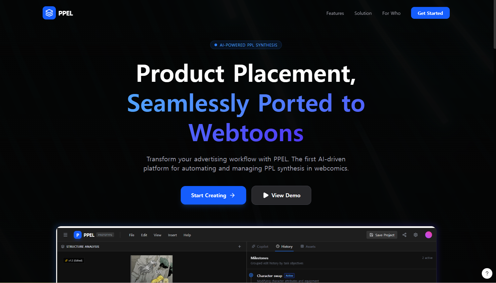 | 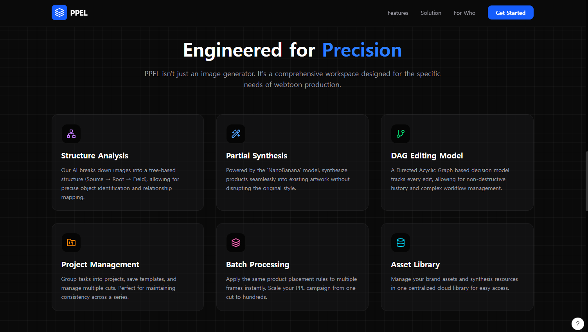 | 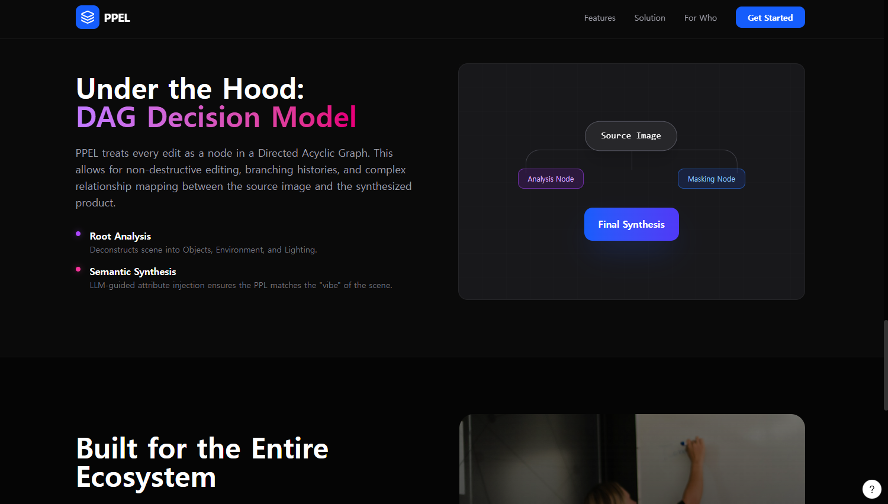 |
---
### 2. 작업화면
|  |  |  |
| --- | --- | --- |
| 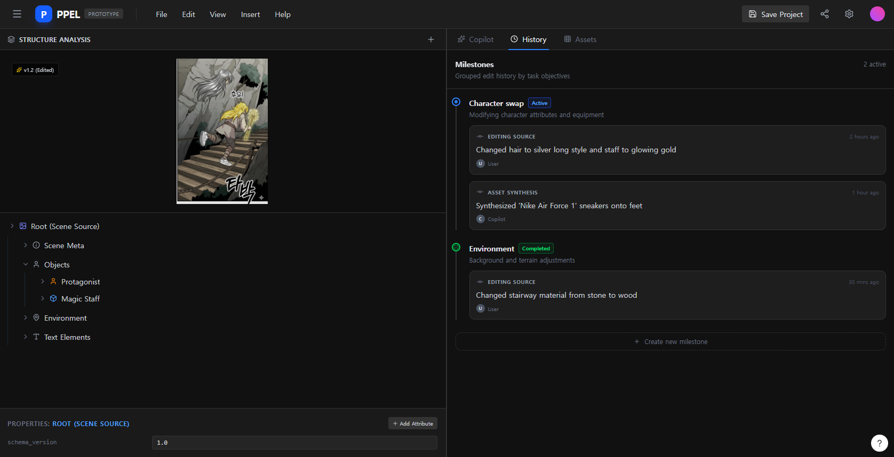 | 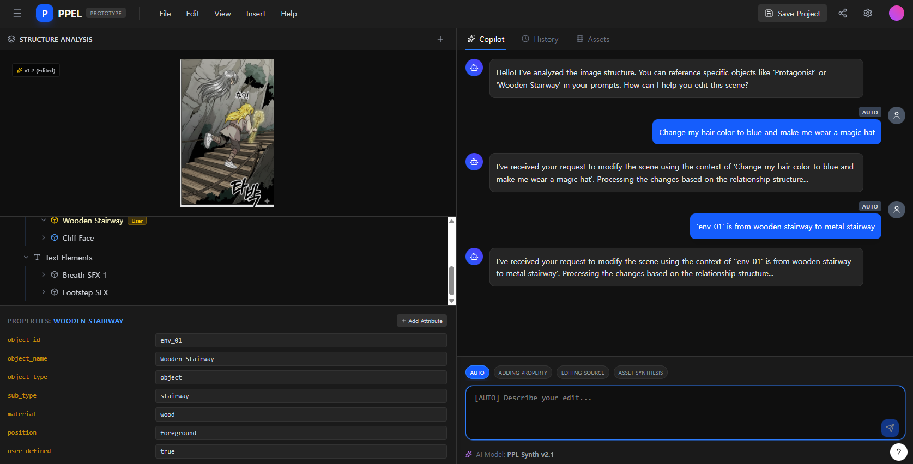 | 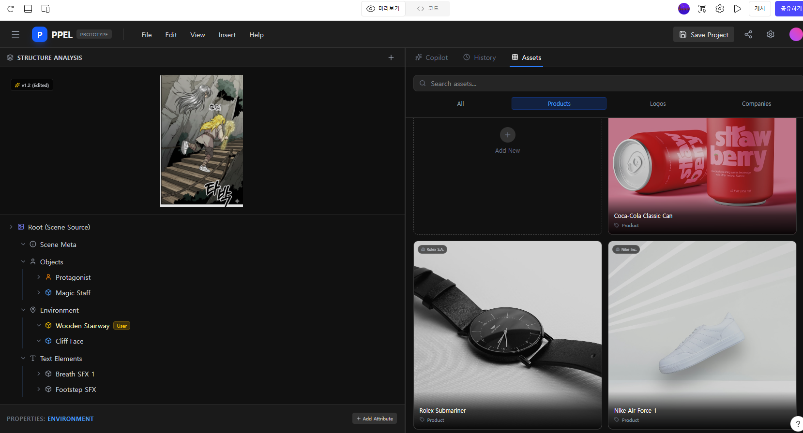 |
---
### 3. DAG 프로세스
|  |  |  |
| --- | --- | --- |
|  | 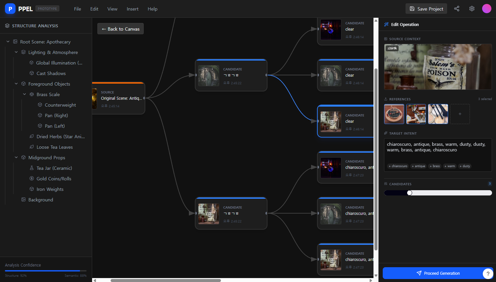 |  |
---